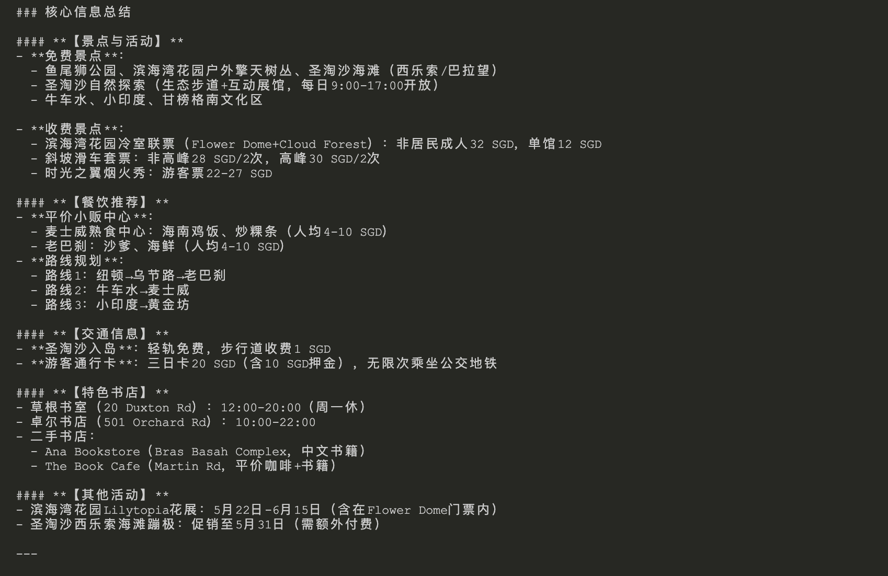

# Deep Search Framework

一个基于 `Tavily API`， `OpenRouter deepseek/deepseek-r1:free` 和网页抓取的信息搜索和分析框架。

## 环境设置

1. 安装依赖:

```bash
pip install -r requirements.txt
```

> Python版本要求: Python 3.10+

2. 配置环境变量:

复制`.env.example`文件（如果存在）或创建一个新的`.env`文件，并设置必要的API密钥:

```
# Tavily API密钥
TAVILY_API_KEY=your_tavily_api_key_here
# OpenRouter API密钥
OPENROUTER_API_KEY=your_openrouter_api_key_here
```

### 获取 API 密钥

- **Tavily API密钥**: 您可以从[Tavily官网](https://tavily.com/)注册并获取API密钥。
- **OpenRouter API密钥**: 访问[OpenRouter官网](https://openrouter.ai/)注册获取免费API密钥。

### 关于 DeepSeek R1 免费模型

本框架使用 OpenRouter 提供的免费 DeepSeek R1 模型。DeepSeek R1 是一个强大的大型语言模型：

- 参数规模：671B参数（推理时激活37B参数）
- 性能：与OpenAI的o1模型相当
- 上下文窗口：163,840 tokens
- 免费使用：通过OpenRouter，输入和输出tokens均为免费
- 开源：完全开源模型，MIT许可

使用 OpenRouter 的 DeepSeek R1 免费模型，你可以在不产生任何API费用的情况下运行本框架，同时保持高质量的搜索和分析结果。

使用方法很简单：只需在`.env`文件中设置你的OpenRouter API密钥，框架将自动使用`deepseek/deepseek-r1:free`模型。

## 使用方法

运行主程序:

```bash
python main.py "your_query_here"
```

## 功能

- 使用Tavily进行网络搜索
- 网页内容抓取和解析
- 基于上下文的内容过滤
- 自动链接提取
- OpenRouter的DeepSeek R1免费模型进行数据分析与调度

## 注意事项

- `.env`文件包含敏感信息，已添加到`.gitignore`中，不会被提交到代码仓库
- 确保您有有效的Tavily API密钥和OpenRouter API密钥 

## 示例

> 示例查询："帮我制定一个计划，5月份到新加坡游玩4-5天，需要尽量保证旅游质量的情况下，经济实惠.
> 1. 我需要保留2天来回的时间（游玩2-3天）.
> 2. 需要著名景点，需要包括书店.
> 3. 餐饮以实惠为主.
> 住宿我可能不关注，可以住在朋友家里."

