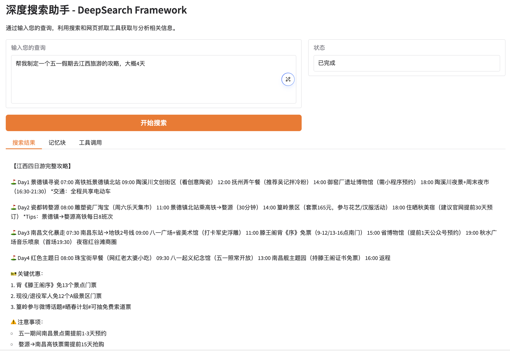

# DeepSearch Framework

一个基于 `Tavily API`、`OpenRouter deepseek/deepseek-r1:free` 和网页抓取的智能信息搜索分析框架。现已支持Web交互界面！


## 功能特点

- **多源信息检索**：通过Tavily搜索引擎获取最新、多样化的信息
- **智能网页抓取**：自动提取网页内容，过滤无关信息
- **记忆化工作流**：使用结构化记忆块系统，有效管理和追踪信息
- **完全免费**：基于OpenRouter的DeepSeek R1免费模型，无需支付API调用费用
- **Web交互界面**：直观的Gradio界面，展示完整搜索过程和结果
- **灵活部署**：支持命令行和Web界面两种使用方式

## 环境要求

- Python 3.10+
- 网络连接（用于API调用和网页抓取）
- Tavily API密钥
- OpenRouter API密钥

## 快速开始

### 1. 安装依赖

```bash
pip install -r requirements.txt
```

### 2. 配置环境变量

复制`.env.example`并创建`.env`文件，填入必要的API密钥:

```
# Tavily API密钥
TAVILY_API_KEY=your_tavily_api_key_here
# OpenRouter API密钥
OPENROUTER_API_KEY=your_openrouter_api_key_here
```

### 3. 启动Web界面（推荐）

```bash
python run.py
```

默认情况下，服务将在`0.0.0.0:7860`上启动。

您也可以通过命令行参数自定义主机和端口：

```bash
# 自定义端口
python run.py --port 8080

# 自定义主机地址和端口
python run.py --host 127.0.0.1 --port 8000

# 查看所有可用选项
python run.py --help
```

启动后访问相应地址即可使用Web界面。



### 4. 或通过命令行使用

```bash
python main.py "你的查询内容"
```

## Web界面特性

新增的Web界面提供了更加直观的使用体验：

- **简洁查询界面**：轻松输入复杂问题
- **分类信息展示**：结果、记忆块、工具调用分页显示
- **可折叠工具调用**：点击展开查看详细工具输出
- **超链接支持**：重要链接以可点击形式呈现
- **实时进度显示**：直观展示搜索分析进度
- **轮数控制**：可设置最大搜索轮数，在速度和深度间取得平衡

## 获取API密钥

本项目依赖两个API密钥：

- **Tavily API密钥**: 访问[Tavily官网](https://tavily.com/)注册获取。新用户有免费额度。
- **OpenRouter API密钥**: 访问[OpenRouter官网](https://openrouter.ai/)注册获取免费API密钥。

## 关于 DeepSeek R1 免费模型

本框架使用 OpenRouter 提供的免费 DeepSeek R1 模型：

- **参数规模**：671B参数（推理时激活37B参数）
- **性能**：与OpenAI的o1模型相当
- **上下文窗口**：163,840 tokens
- **开源许可**：MIT许可
- **完全免费**：通过OpenRouter平台提供，无需支付API费用

## 实际应用场景

DeepSearch Framework适用于多种信息检索和分析场景：

- **旅行规划**：制定详细的旅游行程，包括景点、交通、餐饮推荐
- **市场研究**：收集和分析产品、竞争对手或行业的最新信息
- **学习研究**：对特定主题进行深入调研，汇总关键信息
- **决策支持**：收集多方面信息，辅助复杂决策制定

## 工作原理

1. **任务解析**：分析用户查询，确定信息需求
2. **多轮搜索**：通过search和scrape工具获取信息
3. **记忆管理**：使用唯一ID记忆块存储和更新信息
4. **信息筛选**：自动过滤不相关内容，保留核心信息
5. **结果汇总**：生成全面、条理清晰的最终答案

## 注意事项

- `.env`文件包含敏感信息，已添加到`.gitignore`中
- 网页抓取功能尊重robots.txt规则
- API调用可能受到各平台速率限制

## 贡献

欢迎通过Issue和Pull Request对本项目做出贡献！

## 许可

MIT License